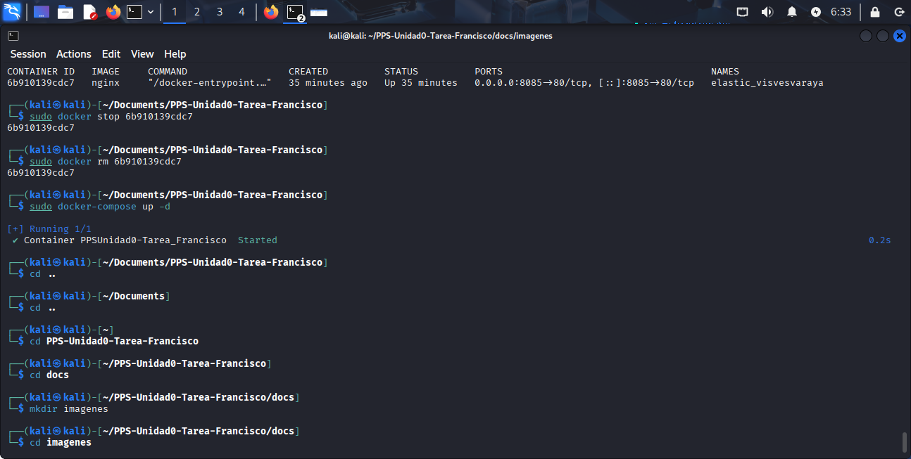
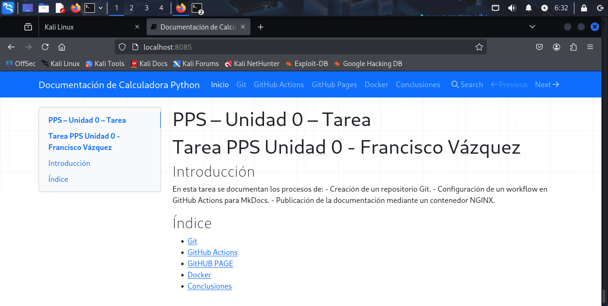

# Publicación de la documentación con Docker y NGINX

## Vamos hacerlo usando Docker Compose
1. Creamos el archivo docker-compose.yml con el siguiente contenido:
```bash
version: "3.8"
services:
  web:
    image: nginx:alpine
    container_name: PPSUnidad0-Tarea_Tu_nombre
    ports:
      - "8085:80"
    volumes:
      - .:/usr/share/nginx/html:ro

```
2. Levanta el contenedor con:
```bash 
docker-compose up -d
```


3. Comprobamos que funcionas entrando en la url( http://localhost:8085)



